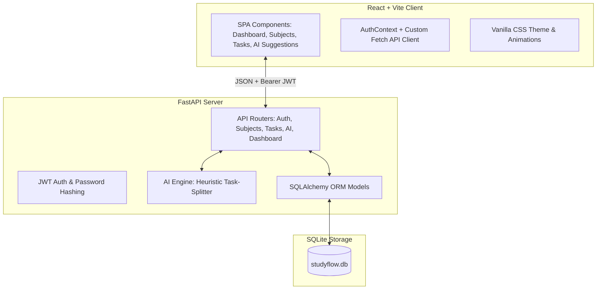

# Implementation Plan - StudyFlow

StudyFlow is an intelligent study organization system designed to help students structure their academic routine. The application consists of a decoupled architecture with a **FastAPI backend** (using SQLite and SQLAlchemy) and a **React + Vite frontend** (styled with premium, custom Vanilla CSS featuring glassmorphism and modern dark-mode visuals).

This document outlines the detailed architectural choices, database design, API routing, AI task-splitting logic, and step-by-step implementation phases.

---

## User Review Required

> [!IMPORTANT]
> **Aesthetics & Styling:**
> We will design the frontend using **Vanilla CSS** (CSS Variables, Flexbox/Grid, and modern glassmorphic styles) rather than TailwindCSS. This ensures a highly customized, premium feel, matching modern dark-mode guidelines without relying on bloated dependencies.
>
> **AI Block Suggestions:**
> The AI task-splitting functionality will be powered by a robust backend heuristic service that analyzes task overload (e.g., >10 pending tasks or heavy estimated weekly hours) and partitions large tasks into optimized Pomodoro study blocks (25-minute study sessions with 5-minute breaks), allowing students to easily accept and generate scheduled sub-tasks.

---

## Proposed System Architecture



---

## Database Schema (SQLAlchemy Models)

We will implement the following relational schema:

1. **User**
   - `id`: Integer (PK)
   - `name`: String (NOT NULL)
   - `email`: String (UNIQUE, NOT NULL, indexed)
   - `password_hash`: String (NOT NULL)
   - `created_at`: DateTime (Default: UTC now)

2. **Subject** (Matéria)
   - `id`: Integer (PK)
   - `user_id`: Integer (FK -> `User.id`, ON DELETE CASCADE)
   - `name`: String (NOT NULL)
   - `color`: String (Hex color code, e.g., `#6366f1`)
   - `weekly_hours`: Integer (Default: 0)
   - `created_at`: DateTime (Default: UTC now)

3. **Task** (Tarefa)
   - `id`: Integer (PK)
   - `user_id`: Integer (FK -> `User.id`, ON DELETE CASCADE)
   - `subject_id`: Integer (FK -> `Subject.id`, ON DELETE CASCADE)
   - `title`: String (NOT NULL)
   - `description`: String (Nullable)
   - `status`: String (Enum: `pending`, `done`, Default: `pending`)
   - `estimated_min`: Integer (Default: 0)
   - `due_date`: DateTime (Nullable)
   - `created_at`: DateTime (Default: UTC now)
   - `updated_at`: DateTime (Default: UTC now)

4. **StudyBlock** (Bloco de Estudo generated by AI Splitter)
   - `id`: Integer (PK)
   - `task_id`: Integer (FK -> `Task.id`, ON DELETE CASCADE)
   - `order`: Integer (NOT NULL)
   - `duration_min`: Integer (NOT NULL)
   - `done`: Boolean (Default: False)

---

## Proposed Changes

We will organize the code into `backend/` and `frontend/` folders in the workspace root.

### Backend Component (`backend/`)

#### [NEW] [backend/requirements.txt](file:///c:/Users/mcclf/OneDrive/%C3%81rea%20de%20Trabalho/StudyFlow/backend/requirements.txt)
Python package specifications: `fastapi`, `uvicorn`, `sqlalchemy`, `pydantic`, `python-jose[cryptography]`, `passlib[bcrypt]`, `python-multipart`.

#### [NEW] [backend/app/config.py](file:///c:/Users/mcclf/OneDrive/%C3%81rea%20de%20Trabalho/StudyFlow/backend/app/config.py)
Manages configuration settings (Database URL, JWT Secret Key, JWT TTL, CORS settings) via environment variables.

#### [NEW] [backend/app/database.py](file:///c:/Users/mcclf/OneDrive/%C3%81rea%20de%20Trabalho/StudyFlow/backend/app/database.py)
Sets up SQLite database session, connection engine, and declarative base class. Enables foreign keys in SQLite:
```python
@event.listens_for(Engine, "connect")
def set_sqlite_pragma(dbapi_connection, connection_record):
    cursor = dbapi_connection.cursor()
    cursor.execute("PRAGMA foreign_keys=ON")
    cursor.close()
```

#### [NEW] [backend/app/models.py](file:///c:/Users/mcclf/OneDrive/%C3%81rea%20de%20Trabalho/StudyFlow/backend/app/models.py)
SQLAlchemy models matching the database schema.

#### [NEW] [backend/app/schemas.py](file:///c:/Users/mcclf/OneDrive/%C3%81rea%20de%20Trabalho/StudyFlow/backend/app/schemas.py)
Pydantic schemas for data validation, response serialization, and auth payloads.

#### [NEW] [backend/app/security.py](file:///c:/Users/mcclf/OneDrive/%C3%81rea%20de%20Trabalho/StudyFlow/backend/app/security.py)
Provides secure password hashing using `passlib` (bcrypt) and JWT encoding/decoding capabilities.

#### [NEW] [backend/app/ai_service.py](file:///c:/Users/mcclf/OneDrive/%C3%81rea%20de%20Trabalho/StudyFlow/backend/app/ai_service.py)
Implements task-splitting suggestions.
- **Criteria:** If user has > 10 pending tasks OR total estimated study time > 20 hours (1200 mins) in the upcoming week.
- **Strategy:** Identifies tasks with a high estimated duration (> 45 minutes) or subjects with dense backlogs, and breaks them into logical 25-minute Pomodoro study blocks with 5-minute rest breaks. Offers user a list of proposed study blocks to assign to those tasks.

#### [NEW] [backend/app/routers/auth.py](file:///c:/Users/mcclf/OneDrive/%C3%81rea%20de%20Trabalho/StudyFlow/backend/app/routers/auth.py)
Endpoints:
- `POST /api/auth/register`: Create user account.
- `POST /api/auth/login`: Return JWT token.
- `GET /api/auth/me`: Get current authenticated user details.

#### [NEW] [backend/app/routers/subjects.py](file:///c:/Users/mcclf/OneDrive/%C3%81rea%20de%20Trabalho/StudyFlow/backend/app/routers/subjects.py)
Endpoints:
- `GET /api/subjects`: List user's subjects.
- `POST /api/subjects`: Create subject.
- `PUT /api/subjects/{id}`: Update subject name, color, weekly_hours.
- `DELETE /api/subjects/{id}`: Delete subject.

#### [NEW] [backend/app/routers/tasks.py](file:///c:/Users/mcclf/OneDrive/%C3%81rea%20de%20Trabalho/StudyFlow/backend/app/routers/tasks.py)
Endpoints:
- `GET /api/tasks`: List user's tasks.
- `POST /api/tasks`: Create task.
- `PUT /api/tasks/{id}`: Update task.
- `PATCH /api/tasks/{id}/status`: Toggle status (pending/done).
- `DELETE /api/tasks/{id}`: Delete task.
- `GET /api/tasks/{id}/blocks`: List study blocks for a task.
- `POST /api/tasks/{id}/blocks`: Manually add study blocks.
- `PATCH /api/tasks/blocks/{block_id}/toggle`: Toggle done status of a block.

#### [NEW] [backend/app/routers/dashboard.py](file:///c:/Users/mcclf/OneDrive/%C3%81rea%20de%20Trabalho/StudyFlow/backend/app/routers/dashboard.py)
Endpoints:
- `GET /api/dashboard/stats`: Aggregates active subjects count, total tasks count, done tasks, weekly target hours, and progress calculation.

#### [NEW] [backend/app/routers/ai.py](file:///c:/Users/mcclf/OneDrive/%C3%81rea%20de%20Trabalho/StudyFlow/backend/app/routers/ai.py)
Endpoints:
- `GET /api/ai/overload-status`: Check if the user meets overload conditions.
- `POST /api/ai/suggest-split`: Return suggested study blocks for pending heavy tasks.
- `POST /api/ai/apply-split`: Create study blocks in DB from suggestions.

#### [NEW] [backend/app/main.py](file:///c:/Users/mcclf/OneDrive/%C3%81rea%20de%20Trabalho/StudyFlow/backend/app/main.py)
Initializes FastAPI, sets up CORS middlewares, imports routers, creates database tables if not existing, and handles root requests.

---

### Frontend Component (`frontend/`)

#### [NEW] [frontend/package.json](file:///c:/Users/mcclf/OneDrive/%C3%81rea%20de%20Trabalho/StudyFlow/frontend/package.json)
Standard dependencies: `react`, `react-dom`. DevDependencies: `@vitejs/plugin-react`, `vite`.

#### [NEW] [frontend/vite.config.js](file:///c:/Users/mcclf/OneDrive/%C3%81rea%20de%20Trabalho/StudyFlow/frontend/vite.config.js)
Vite dev server config with a proxy to `http://localhost:8000/api` for simple API routing.

#### [NEW] [frontend/index.html](file:///c:/Users/mcclf/OneDrive/%C3%81rea%20de%20Trabalho/StudyFlow/frontend/index.html)
Root HTML file featuring Outfit and Inter fonts loaded from Google Fonts.

#### [NEW] [frontend/src/index.css](file:///c:/Users/mcclf/OneDrive/%C3%81rea%20de%20Trabalho/StudyFlow/frontend/src/index.css)
Global styling containing custom CSS variables (indigo, violet, dark/light slate, glass effect blur constants), transitions, animations, reset rules, and custom scrollbars.

#### [NEW] [frontend/src/context/AuthContext.jsx](file:///c:/Users/mcclf/OneDrive/%C3%81rea%20de%20Trabalho/StudyFlow/frontend/src/context/AuthContext.jsx)
State context for User Authentication (login state, register/login handlers, loading state, local storage persistence).

#### [NEW] [frontend/src/services/api.js](file:///c:/Users/mcclf/OneDrive/%C3%81rea%20de%20Trabalho/StudyFlow/frontend/src/services/api.js)
Core service containing parameterized `fetch` requests with JWT injection and request interceptors.

#### [NEW] [frontend/src/components/Navbar.jsx](file:///c:/Users/mcclf/OneDrive/%C3%81rea%20de%20Trabalho/StudyFlow/frontend/src/components/Navbar.jsx)
Dynamic glassmorphism navigation header with user profile badge and tabs to switch views.

#### [NEW] [frontend/src/components/Auth.jsx](file:///c:/Users/mcclf/OneDrive/%C3%81rea%20de%20Trabalho/StudyFlow/frontend/src/components/Auth.jsx)
Auth card view (interactive flipping transition between Login and Register states).

#### [NEW] [frontend/src/components/Dashboard.jsx](file:///c:/Users/mcclf/OneDrive/%C3%81rea%20de%20Trabalho/StudyFlow/frontend/src/components/Dashboard.jsx)
Dashboard view:
- Weekly progress bar widget.
- Overview metrics (Total Tasks, Done, Remaining, Subjects Active).
- Quick tasks due today.
- Visual interactive widgets showing load status.

#### [NEW] [frontend/src/components/Subjects.jsx](file:///c:/Users/mcclf/OneDrive/%C3%81rea%20de%20Trabalho/StudyFlow/frontend/src/components/Subjects.jsx)
Subjects view:
- Grid layout showing cards for each subject.
- Visual display of hours and color.
- Modals for creating and editing a subject.
- Confirmation modal for deletion.

#### [NEW] [frontend/src/components/Tasks.jsx](file:///c:/Users/mcclf/OneDrive/%C3%81rea%20de%20Trabalho/StudyFlow/frontend/src/components/Tasks.jsx)
Tasks view:
- Task list filterable by subject and status.
- Add Task form (links to created subjects).
- Checkboxes to easily toggle task status with interactive animation.
- Expandable details showing Study Blocks if generated, allowing user to toggle block-level progress.

#### [NEW] [frontend/src/components/AISuggestions.jsx](file:///c:/Users/mcclf/OneDrive/%C3%81rea%20de%20Trabalho/StudyFlow/frontend/src/components/AISuggestions.jsx)
AI Suggestions view:
- Active overload monitoring widget.
- Action button: "Analisar Rotina" (Analyze Routine).
- Animated cards displaying AI suggestions to split specific heavy tasks.
- "Aplicar Sugestões" (Apply Suggestions) button to bulk-add study blocks in backend.

#### [NEW] [frontend/src/App.jsx](file:///c:/Users/mcclf/OneDrive/%C3%81rea%20de%20Trabalho/StudyFlow/frontend/src/App.jsx)
Aggregates state routing, Auth wraps, views rendering, and manages toasts/notifications.

---

## Verification Plan

### Automated Verification
1. **Backend Unit Tests:** Use `pytest` to test authentication lifecycle, CRUD endpoints, security middleware, and the AI task splitting module.
2. **Visual Audits:** Launch the app locally and audit responsive viewport sizing (mobile 375px, tablet 768px, desktop 1200px) using the browser subagent tool.

### Manual Verification
1. Register user -> Login -> Verify token storage.
2. Create subjects and verify color cards.
3. Add heavy tasks (e.g., total > 20 hours estimated) and trigger AI Suggestions panel.
4. Verify split blocks generation and toggle completed blocks to see task progression.
